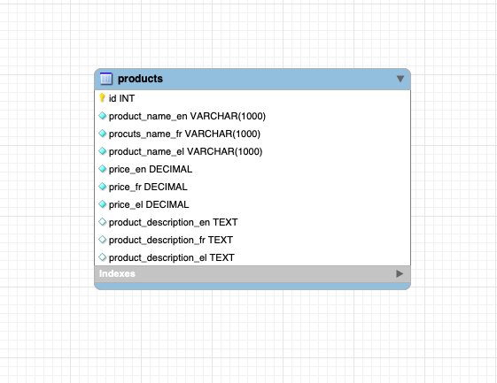
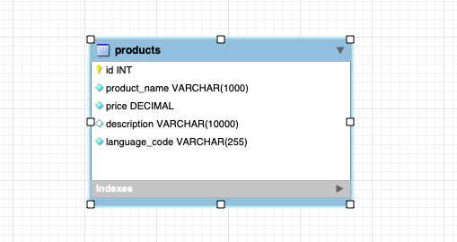
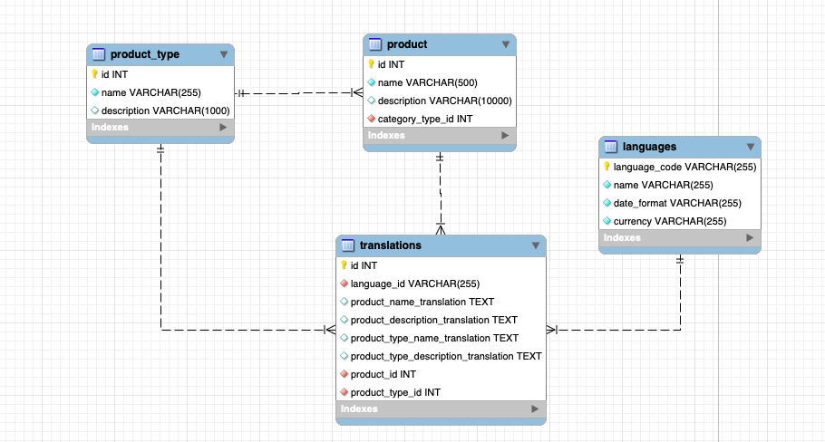
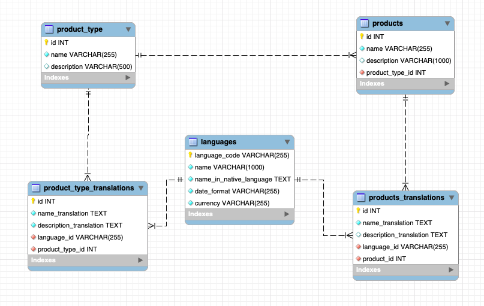

# Database Internationalization(I18N)/Localization(L10N) design patterns
[оригинал](https://medium.com/walkin/database-internationalization-i18n-localization-l10n-design-patterns-94ff372375c6)

В эту современную эпоху, мы хотим раширить наш бизнес на разные части мира, что бы достичь больших продаж и большей прибыли.
Но распостранение бизнеса по миру совсем не просто, если вы не используете локализацию.
В разных сранах используются разные языки, системы измерения, валюты и т. п.
В этой статье я хочу показать разные патерны проектирования базы для локализации.

Если вы хотите знать больше о использовании интернатиализации в базах данных - можете почитаь мой блог.

Вачале я бы хотел дать небольшую вводную о проблеме.

**Internationalization(I18N)** это процесс проектирования приложения для возможности работы с различными 
языками и регионами `без изменения кода`

**Localization(L10N)** это процесс `подготовки интернационального приложения` для конкретного региона или языка
добавляя спецефические для региона компоненты и переводы текстов.

Localization не означает только перевод, а еще включает 
- формат даты времени
- формат чисел
- часовые пояса
- формат календарей
- формат валюты
- налоги
- единицы измерения
- почтовые индексты и форматы телефонных номеров
- форматы адрессов

А теперь перейлем к патернам.

####1. Отдельная колонка под каждое поле и язык
Это самый простой путь реализации.
   
  
Pros 
- простая реализация и запросы.

Cons 
- Не масштабируется.
- Число столбцов растет очень быстро.
- Забытый столбец для одного языка - ломает приложение.
- сложно поддерживать разные форматы времени, адревсов и т. п.
   
   
####2. Отдельная строка под каждый язык
   
   
   
Pros:-
- простое решение
Cons:-
- нет централизации. Вы не знаете какие таблицы или даже записи поддерживают тот или иной язык.
- сложно поддерживать зависимости между продуктами на разных языках.   

####2. Отдельная строка под каждый язык
   
   
   
Pros:-
- простое решение
Cons:-
- нет централизации. Вы не знаете какие таблицы или даже записи поддерживают тот или иной язык.
- сложно поддерживать зависимости между продуктами на разных языках.   

####3. Отдельная таблица переводов
   
   
   
Pros:-
- Более централизованный подход
- Проще отслеживать форматы
Cons:-
- Нужно соеденять таблицы
- огромная таблица переводов с долгими запросами
- все переводы завязаны на одну таблицу

Note:-
1. Вообще это просто комбинация двух первых способов.
Вообще можно было бы все переводы для одной записи хранить в одной строке, но тогда необходимо будет менять таблицу под новые языки.

####4. Отдельные таблицы переводов
   
  

Pros:-
- Не нужно соединять таблицы для данных которые мы не перевели
- Более легкие и простые запросы
- нет расхождения в даннных
- более эфективная локализация, так как мы можем хранить и другие данные контента.